# Youth Leadership Tracker (YLT)

<div align="center">
  <h3>Manage AIESEC members, experiences, and leadership development.</h3>
</div>

## 📌 Overview

**Youth Leadership Tracker** is a modern web application designed to help youth organizations (specifically AIESEC) manage their membership base, track leadership experiences, and analyze organizational data.

Built with **Angular**, it offers a responsive, fast, and intuitive interface for managing:
- **Members**: Profiles, skills, and department allocations.
- **Experiences**: Leadership roles, team experiences, and duration tracking.
- **Analytics**: Real-time dashboard with key performance indicators.

## ✨ Key Features

- **🔐 Authentication & Security**
  - Secure login with email validation.
  - Account lockout mechanism after 3 failed attempts (security best practice).
  - Role-based access control (RBAC).

- **👥 Member Management**
  - CRUD operations (Create, Read, Update, Delete) for members.
  - Advanced search and filtering by department, name, and skills.
  - Profile customization including bio, skills, and role.
  - **Smart Sync**: Updating a member's email automatically updates their login credentials.

- **🏆 Experience Tracking**
  - Track leadership roles (Team Leader, VP, etc.).
  - Department-specific experience logging.
  - Status tracking (Active vs. Completed experiences).
  - Skill acquisition tracking per experience.

- **📊 Interactive Dashboard**
  - Real-time statistics on membership growth.
  - Visual charts for top skills and department distribution.
  - Key metrics at a glance (Total Members, Active Roles, etc.).

- **🌍 Internationalization (i18n)**
  - Multi-language support (English / French / Arabic).
  - Seamless language switching.

- **💾 Data Persistence**
  - LocalStorage-based data persistence for demo purposes.
  - Data remains available across page reloads.

## 🛠️ Technology Stack

- **Framework**: [Angular 18+](https://angular.io/) (Standalone Components)
- **Styling**: [Tailwind CSS](https://tailwindcss.com/)
- **Charts**: [Ng2-Charts](https://valor-software.com/ng2-charts/) (Chart.js)
- **Icons**: [Lucide Icons](https://lucide.dev/) (or similar SVG set)
- **State Management**: RxJS (BehaviorSubjects)
- **Build Tool**: Angular CLI

## 🚀 Getting Started

Follow these steps to set up the project locally.

### Prerequisites
- Node.js (v18 or higher)
- npm (v9 or higher)
- Angular CLI (`npm install -g @angular/cli`)

### Installation

1. **Clone the repository**
   ```bash
   git clone https://github.com/your-username/youth-leadership-tracker.git
   cd youth-leadership-tracker
   ```

2. **Install dependencies**
   ```bash
   npm install
   ```

3. **Start the development server**
   ```bash
   npm start
   # or
   ng serve
   ```

4. **Access the application**
   Open your browser and navigate to `http://localhost:4200`.

### Building for Production

To create an optimized build for deployment:

```bash
npm run build
```
The artifacts will be stored in the `dist/` directory.

## 📸 Screenshots

| Dashboard (Dark Mode) | Dashboard (Light Mode) |
|-----------|----------------|
| 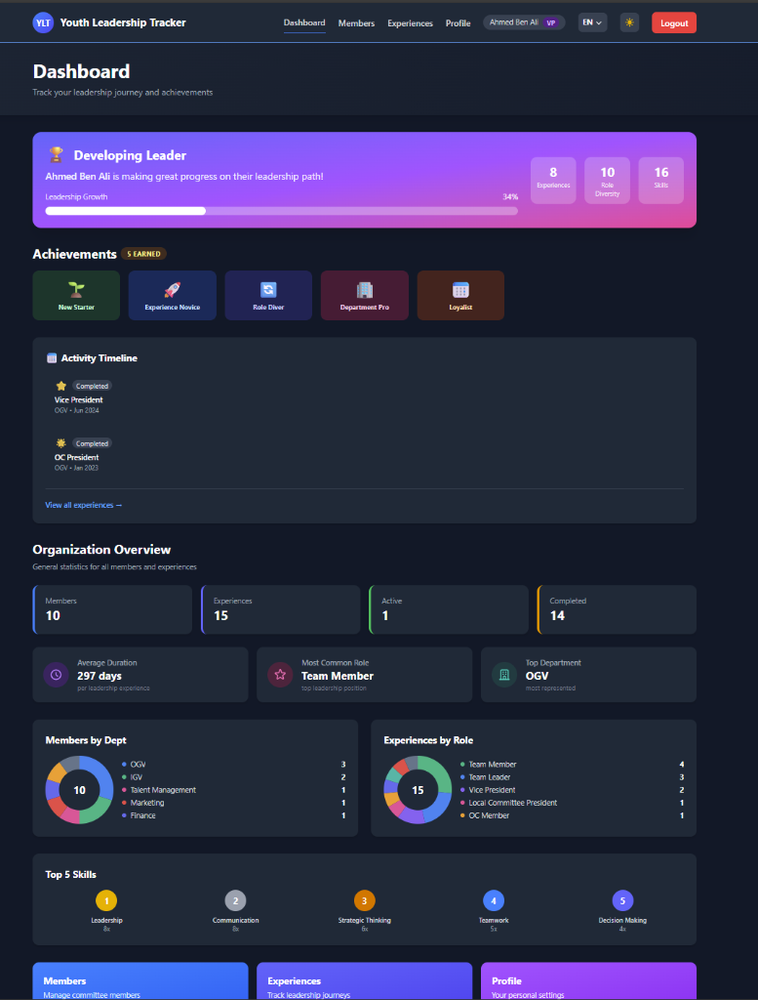 | 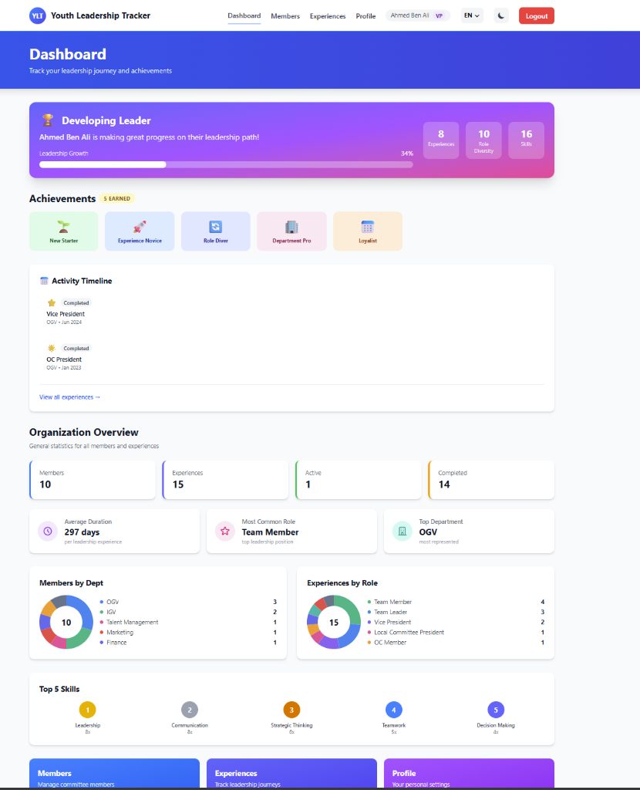 |

| Members Management | Experiences Tracking | User Profile |
|--------------------|----------------------|--------------|
| 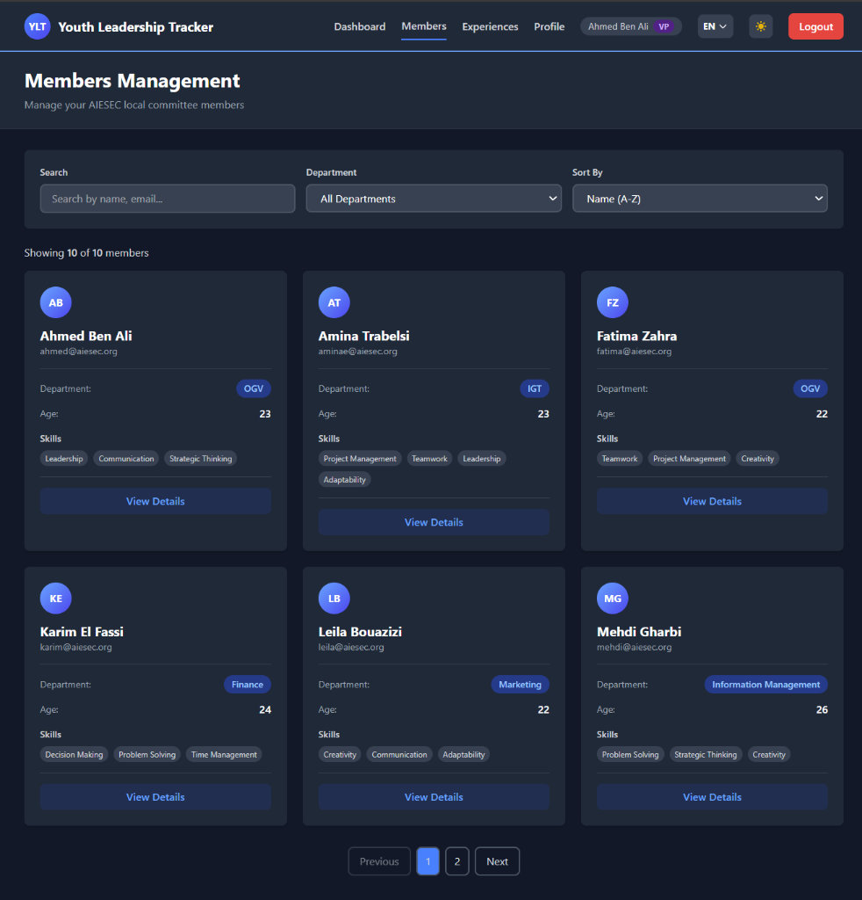 | 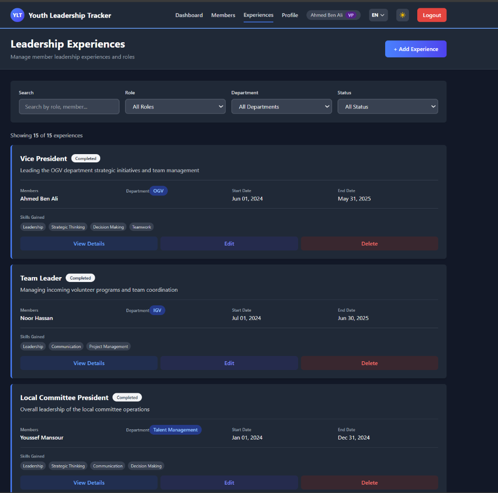 | 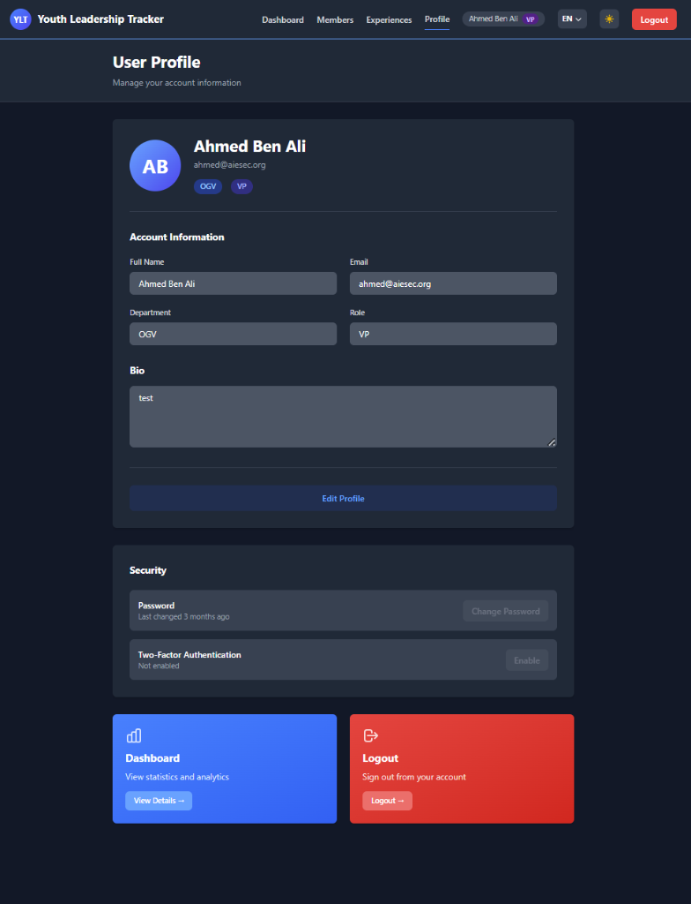 |

### � Authentication

| Login Screen | Registration |
|--------------|--------------|
| 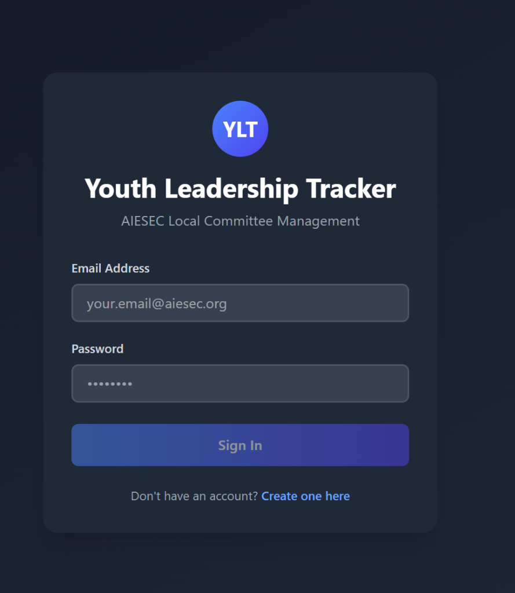 | 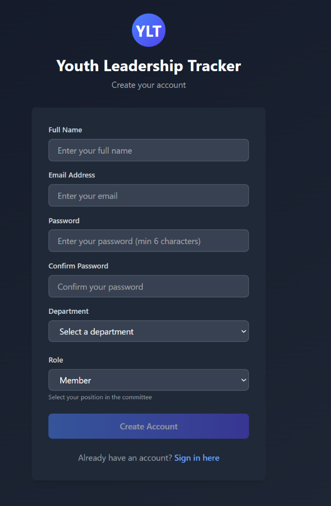 |

### �📝 Forms & Management

| Create Member | Edit Member |
|---------------|-------------|
| 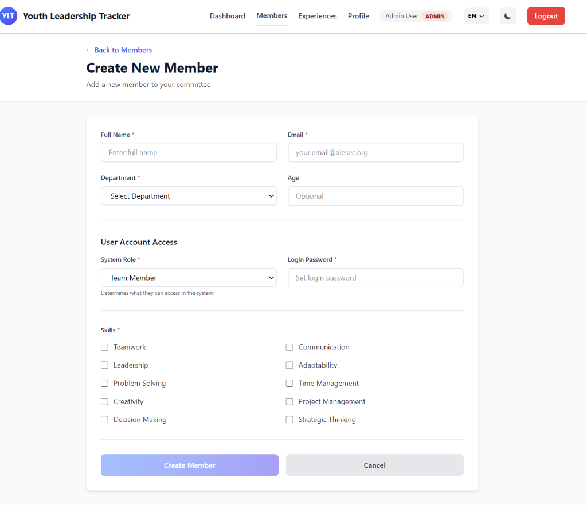 | 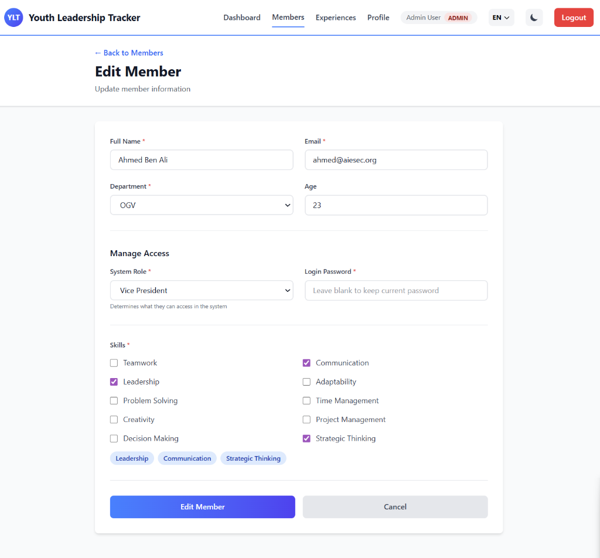 |

| Create Experience | Edit Experience |
|-------------------|-----------------|
| 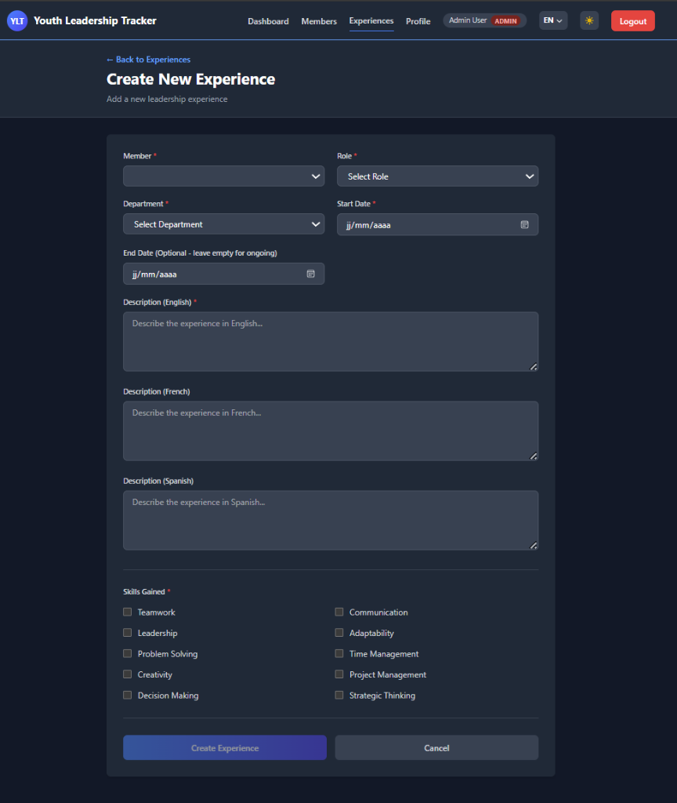 | 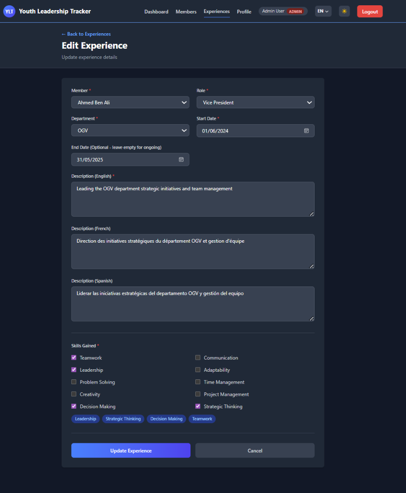 |

### 🌍 Localization (Spanish/Español)

| Dashboard (ES) |
|----------------|
|  |

## 🤝 Contributors

This project is developed and maintained by **Aziz Guidara** and **Zeineb Karoui**.

## 📄 License

This project is licensed under the MIT License - see the LICENSE file for details.
